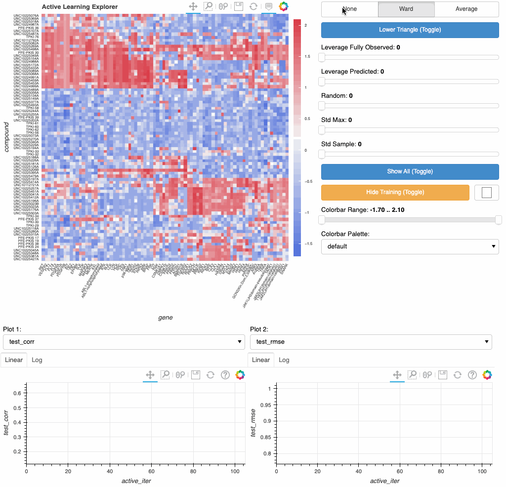

# exploreML
Interactive bokeh dashboard for analyzing active learning experiments and matrix completion models



## Requirements
bokeh == 2.4.0 <br>

## Getting started
Clone repo and cd into the project directory

```
$ git clone https://github.com/oaoni/exploreML.git
```

Launch in a classic jupyter notebook

```
$ jupyter notebook
```

### Usage

```
from exploreML import loadActiveH5, ActiveExplore

# Load demo data from Published Kinase Inhibitor Set (PKIS) small molecule to gene interactions
data_dict, sampling_dict = loadActiveH5()

row_name = 'compound'
col_name = 'gene'
# Interactive dashboard saved as: active_explorer.html
active = ActiveExplore(data_dict, sampling_dict,row_name=row_name,col_name=col_name)
```
